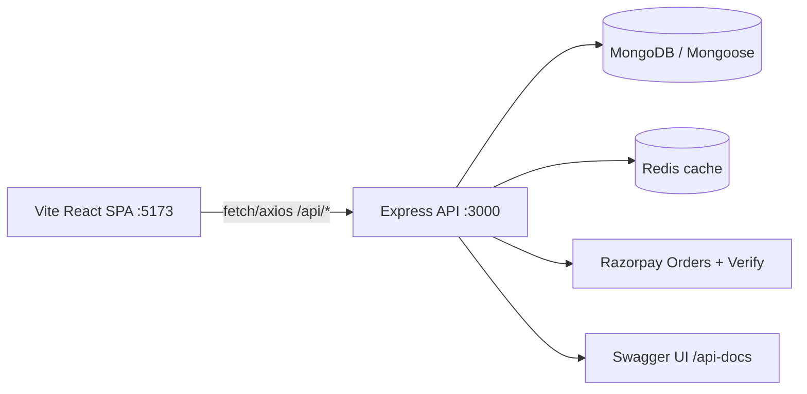

# LearnEn — Learn + Earn | Mentor-Led Study Rooms & Courses


> **Full-Stack Academic Project** — a course / study-room marketplace where **mentors create Course Rooms**, **students discover, pay for, and join them**, and **admins moderate users, courses, and reports**.
>
> Think *Udemy meets study rooms*: each course is a **Room** with a meet link, price, skills, **assignments, study resources, live schedules / study sessions, participants, and reports**.

**Deployed API:** `https://learnen-react.onrender.com/api/` · **Swagger docs:** `https://learnen-react.onrender.com/api-docs` (or `http://localhost:3000/api-docs` locally)

---

## Table of Contents


- [Features](#features)
- [Architecture](#architecture)
- [Tech Stack](#tech-stack)
- [Monorepo Layout](#monorepo-layout)
- [API Quick Reference](#api-quick-reference)
- [Getting Started (local, native npm)](#getting-started-local-native-npm)
- [Environment Variables](#environment-variables)
- [Docker Alternative](#docker-alternative)
- [Tests](#tests)
- [CI/CD](#cicd)
- [Known Limitations / Future Work](#known-limitations--future-work)
- [Academic Context](#academic-context)
- [Security Note](#security-note)
- [License](#license)

---

## Features

### Student
- Browse / explore courses (`Explore.jsx` → `GET /api/explorecourses`)
- Course checkout with **Razorpay** (`CourseCheckout/` → `POST /api/payment/orders` + `/verify`, then `POST /api/buycourse`)
- Joined-courses dashboard (`Joined.jsx` → `POST /api/getjoinedcourses`)
- Per-room **assignments** (`Assignment.jsx`), **resources/documents** (`Document.jsx`), **study schedules** (`SdMiddle.jsx`)
- Profile update with image upload (`UpdateMP.jsx` → `POST /api/updateuser` + `GET /api/getupdateuser`)
- Logout (`GET /api/logout`)

### Mentor
- Create Course Rooms with title, price, meet link, skills, description, cover image (`CreateRoom.jsx` → `POST /api/addroom`)
- View created courses (`MentorCourses.jsx` → `POST /api/getcreatedcourses`)
- Inside a Course Room (`CourseRoomMain.jsx` + `courseRoom*.jsx`):
  - **Assignments:** `POST /api/addassignment`, `POST /api/getcourseassignments`
  - **Resources:** `POST /api/addresource`, `POST /api/getresources`
  - **Schedules / study sessions:** `POST /api/addschedule`, `POST /api/getSchedulesByCourse`
  - **Participants:** `POST /api/getParticipants`
  - **Reports:** `POST /api/submitReports`
- Personal schedule feed (`MdMiddle.jsx` → `POST /api/getSchedule`)

### Admin
- All rooms + users overview (`adminGeneral.jsx` → `GET /api/adminRooms`, `GET /api/getUsers`, `GET /api/Reports`)
- Delete users / courses (`POST /api/deleteUser`, `POST /api/deleteCourse`)
- Review reports (`adminReports.jsx` → `GET /api/Reports`)

### Platform-wide
- Auth: signup / login / logout / verification / mentor application, security Q&A, bcrypt-hashed passwords
- File uploads via `multer` (`server/uploads/`), request logging (`morgan` → `server/logs/YYYY-MM-DD.log`), gzip (`compression`), sessions (`express-session`), CSRF token endpoint (`GET /api/getCSRFToken`)
- Redis caching layer for room queries (`controllers/roomController.js`)
- Swagger/OpenAPI at `/api-docs`, Jest + Supertest suite in `server/__tests__/`

---

## Architecture



- **Client:** `client/` — React 18 SPA, React Router (`App.jsx` routes), Redux Toolkit store, Tailwind, Framer Motion, Three.js/Spline visuals, Firebase + EmailJS integrations.
- **Server:** `server/` — Express REST API under `/api`, Mongoose models (`User`, `Room`, `Assignment`, `Resource`, `Schedule`, `Report`), `multer` uploads, payment routes, Swagger via `swagger-jsdoc`.
- **Data model (simplified):** `User { Joined_Room[], Created_Room[], Position: student|mentor|admin }` ↔ `Room { mentor, participants[], assignment[], resource[], schedule[], reports[], price, meetlink, skills }`.

Routes on the frontend (`client/src/App.jsx`):
`/`, `/login`, `/signup`, `/verification`, `/mentorApplication`, `/studentDashboard`, `/mentorDashboard`, `/adminDashboard`, `/courseRoom`, `/courseCheckOut`, `/update`, `/error`.

---

## Tech Stack

| Layer | Tech |
|---|---|
| Frontend | React 18, Vite 4, react-router-dom 6, Redux Toolkit, Axios, TailwindCSS 3, Framer Motion, Three.js (`@react-three/fiber/drei`), Spline, Firebase, recharts, react-toastify, EmailJS, FontAwesome |
| Backend | Node 20, Express 4, Mongoose 8, Redis 4, express-session, Passport, csurf, multer (+ Cloudinary storage pkg), Razorpay SDK, Swagger (`swagger-jsdoc` + `swagger-ui-express`), morgan, compression, body-parser, cookie-parser |
| Data/infra | MongoDB (Atlas or local), Redis (Cloud or local), Docker + docker-compose (mongo + redis + node), Render deploy, GitHub Actions CI |
| Tests | Jest 29, Supertest, Chai, jest-html-reporter |

---

## Monorepo Layout

```
learnen-react/
├── client/                  # Vite React app (port 5173)
│   ├── src/
│   │   ├── App.jsx          # all routes
│   │   ├── main.jsx + store/store.js  # Redux provider
│   │   ├── features/wishListSlice.js
│   │   └── pages/
│   │       ├── Landingpage/ LoginPage/ SignUp/ VerificationPage/
│   │       ├── StudentDashboard/ MentorDashboard/ AdminDashboard/
│   │       ├── CourseRoom/ CourseCheckout/ MentorApplication/
│   │       ├── UserProfileChange/ Contact/ AboutUs/ Error/ firebase/
│   ├── vite.config.js
│   └── .env.example         # VITE_API_URL + EmailJS keys
├── server/                  # Express API (port 3000)
│   ├── server.js            # app entry, /api mount, Swagger, CSRF, logs
│   ├── routes/Route.js      # ~25 REST endpoints (+ Swagger annotations)
│   ├── routes/payment.js    # Razorpay orders/verify
│   ├── routes/auth.js
│   ├── controllers/         # user, room, assignments, resources, schedule, admin, dashboard
│   ├── models/              # User, Room, Assignment, Resource, Schedule, Report
│   ├── __tests__/routes.test.js
│   ├── docker-compose.yaml + Dockerfile + start.sh
│   └── .env.example         # MONGO_URL, Razorpay, Redis, PORT
├── .github/workflows/main.yml  # test → Render deploy
└── README.md                # this file
```

---

## API Quick Reference

Base URL: `http://localhost:3000/api` locally · `https://learnen-react.onrender.com/api` deployed. Full spec at `/api-docs`.

| Method & Path | Purpose |
|---|---|
| `POST /api/signup` | Register (name, email, password, phone, security Q/A) |
| `POST /api/login` | Login |
| `GET /api/logout` | Logout |
| `POST /api/updateuser` (multipart `profileImage`) | Update profile |
| `GET /api/getupdateuser?userId=` | Get profile |
| `POST /api/addroom` | Mentor creates course-room |
| `GET /api/getCourse?courseId=` | Get one course |
| `GET /api/explorecourses` | List all courses |
| `POST /api/buycourse` | Join/buy course (`{userId, roomId}`) |
| `POST /api/getcreatedcourses` | Mentor's created rooms |
| `POST /api/getjoinedcourses` | Student's joined rooms |
| `GET /api/adminRooms` | Admin: all rooms + users |
| `POST /api/addassignment` / `POST /api/getcourseassignments` / `GET /api/getassignments` | Assignments |
| `POST /api/addresource` / `POST /api/getresources` | Resources |
| `POST /api/addschedule` / `POST /api/getSchedulesByCourse` / `POST /api/getSchedule` | Schedules / study sessions |
| `POST /api/getParticipants` | Room participants |
| `POST /api/getAssignmentsJoined` / `POST /api/getresourcesJoined` | Aggregated feeds for joined rooms |
| `GET /api/dashboard` | Dashboard |
| `GET /api/getUsers` / `POST /api/getUserName` / `POST /api/deleteUser` / `POST /api/deleteCourse` | Admin moderation |
| `POST /api/submitReports` / `GET /api/Reports` | Reports |
| `POST /api/payment/orders` / `POST /api/payment/verify` | Razorpay create + verify |
| `GET /api/getCSRFToken` | CSRF token |
| `GET /api-docs` | Swagger UI |

---

## Getting Started (local, native npm)

### Prerequisites
- **Node 20.x** + npm
- MongoDB: local (`brew install mongodb-community` / `mongod`) **or** a free Atlas cluster
- Redis: optional locally — app defaults to `localhost:6379`; without Redis some cached reads log errors but API still runs. For full behavior: `brew install redis && brew services start redis` (or Docker: `docker run -p 6379:6379 redis`).
- Razorpay test keys (optional for checkout): https://dashboard.razorpay.com/app/keys

### 1) Backend — `http://localhost:3000`
```bash
cd server
npm install
cp .env.example .env
# edit .env -> set MONGO_URL (local or Atlas), Razorpay keys, REDIS_HOST/PORT
npm start          # nodemon server.js
```
Verify:
- `http://localhost:3000/api-docs` → Swagger UI
- `curl http://localhost:3000/api/explorecourses`

Logs go to `server/logs/YYYY-MM-DD.log`. Uploads to `server/uploads/`.

### 2) Frontend — `http://localhost:5173`
```bash
cd client
npm install
cp .env.example .env
# optional: set VITE_API_URL=http://localhost:3000/api, EmailJS keys
npm run dev        # vite --host
```
Open `http://localhost:5173/`.

> **Important — API pinning:** the client currently hardcodes `https://learnen-react.onrender.com/api` in ~40 `fetch`/`axios` calls (e.g. `LoginPage.jsx:20`, `Explore.jsx:11`, `CourseCard.jsx:25`). So out of the box the local UI still talks to the **deployed** backend. For a true local end-to-end run you must either (a) keep using the deployed API (zero backend setup), or (b) refactor to a shared `VITE_API_URL` helper — listed under Future Work. `client/.env.example` is ready for (b).

### Typical smoke flow
1. `/signup` → `/verification` → `/login`
2. As mentor: `/mentorDashboard` → create room → open `/courseRoom?courseId=...` → add assignment / resource / schedule
3. As student: `/studentDashboard` → Explore → `/courseCheckOut` (Razorpay test) → joined room appears in `Joined`
4. As admin: `/adminDashboard` → users / courses / reports

---

## Environment Variables

### `server/.env` (see `server/.env.example`)
| Key | Example | Required |
|---|---|---|
| `MONGO_URL` | `mongodb://localhost:27017/learnen` | yes |
| `Key_Id` / `KEY_SECRET` | `rzp_test_XXXX` | only for payments |
| `PORT` | `3000` | no (default 3000) |
| `CLIENT_URL` | `http://localhost:5173` | no |
| `SESSION_SECRET` | `change-me` | recommended |
| `REDIS_HOST` / `REDIS_PORT` / `REDIS_PASSWORD` | `localhost` / `6379` / `` | no (defaults to localhost:6379) |

### `client/.env` (see `client/.env.example`)
| Key | Example |
|---|---|
| `VITE_API_URL` | `http://localhost:3000/api` (after refactor; currently informational) |
| `VITE_APP_EMAILJS_SERVICE_ID` / `..._TEMPLATE_ID` / `..._PUBLIC_KEY` | from EmailJS dashboard |

---

## Docker Alternative

`server/docker-compose.yaml` spins up `node-app + mongodb + redis`:
```bash
cd server
docker compose up --build
```
Note: `Dockerfile`/`start.sh` are server-oriented and the compose port mapping (`4000:4000`) differs from the code's `app.listen(3000)` — treat Docker as a starting point, native npm is the verified path.

---

## Tests

```bash
cd server
# set MONGO_URL to a throwaway test DB first!
npm test   # jest --reporters=default + jest-html-reporter -> test-report.html
```
Covers signup/login/logout, rooms (add/get/explore/buy/created/joined/admin list), assignments, resources, schedules (`__tests__/routes.test.js`). Warning: `afterAll` calls `User.deleteMany({})` + `Room.deleteMany({})` — **never point it at production**.

---

## CI/CD

`.github/workflows/main.yml` — on push to `main`: `npm install` + `npm test` in `server/`, then deploy to Render via `johnbeynon/render-deploy-action` (`SERVICE_ID` + `RENDER_API_KEY` secrets).

---

## Known Limitations / Future Work

- [ ] Centralize API base URL: replace ~40 hardcoded `https://learnen-react.onrender.com/api` strings with `import.meta.env.VITE_API_URL` helper + axios instance
- [ ] Remove duplicate route registrations at bottom of `routes/Route.js:724-734`
- [ ] Role-based auth middleware (admin checks are stubs: `if (true)` in `roomController.js:41`)
- [ ] Move `express-session` from `MemoryStore` to Redis store for production
- [ ] `express.static('uploads')` path + `localhost:3000` image URLs in `UpdateMP.jsx:95` break behind Render — serve via absolute/CDN URL
- [ ] Rotate any previously committed secrets; require `.env` (now git-ignored) + use `.env.example`

---

## Academic Context

Built as part of a **Full-Stack Development course**: React + Express + MongoDB + Redis, REST design, auth/sessions, file uploads, payments, caching, logging, API docs, automated tests, CI/CD, and Docker. Good demo talking points: role-based dashboards, Room as aggregate root, Razorpay order→verify→enroll flow, Redis cache-aside, Swagger-first docs.

---

## Security Note

This repo previously contained live Atlas/Razorpay/Redis credentials in `server/.env`, `roomController.js`, and `__tests__/`. Those are now moved to `.env` (git-ignored) + `.env.example`, with code reading `process.env`. **Rotate the old keys** (Atlas password, Razorpay test secret, Redis password) since they were in git history — see `git log -p -- server/.env`.

---

## License

No license file — default all-rights-reserved (academic project). Add MIT if you want open-source: `npx mit-license` or copy https://opensource.org/licenses/MIT.
